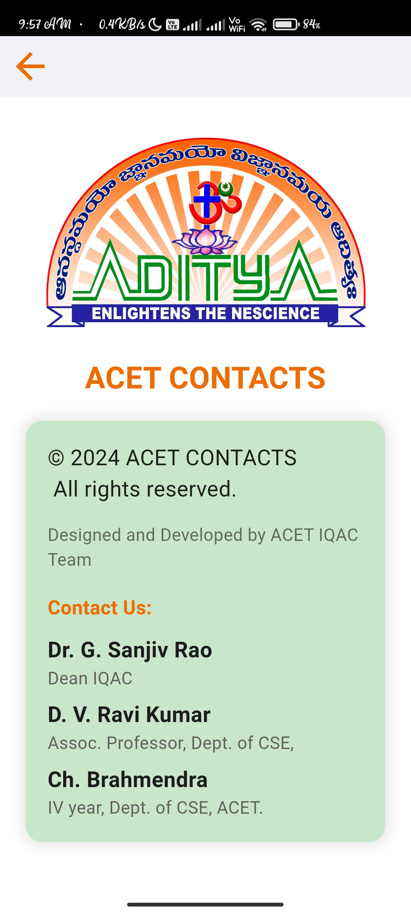
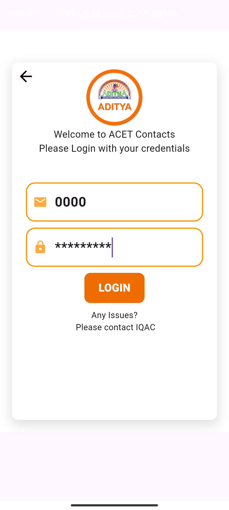

# ACET CONTACTS (MOBILE APPLICATION)

## Overview
**ACET CONTACTS** is a mobile application designed to provide comprehensive contact information for the staff of Aditya College of Engineering and Technology. Built using Flutter and Firebase, the application aims to streamline communication by offering easily accessible contact details categorized by departments, HODs, Deans, the Principal, and various committees. Users can also search for specific staff members by name or employee ID.

## App Screenshots

### Splash Screen and Info Screen (Side by Side)

    
    

### Login Screen and Update Login Screen (Side by Side)

    
    

### Main Screen 1 and Main Screen 2 (Side by Side)

    
    

### Search by Employee Name and Search by Employee ID (Side by Side)

    
    

### Profile Screen and Update Profile Screen (Side by Side)

    
    

### Deans Screen and Departments Screen (Side by Side)

    
    

### Committees Screen (Solo)

## Features

### Categorized Contact Information
- **Departments**: Access contact details of staff members organized by their respective departments.
- **HOD's**: Detailed contact information for Heads of Departments.
- **Deans**: Information for Deans across various faculties.
- **Principal**: Direct contact details of the college Principal.
- **Committees**: Contact details for members of various college committees.

### Search Functionality
- A powerful search feature that allows users to find staff members by entering their name or employee ID, providing quick access to their details and contact information.

### Admin Portal
- An admin portal for managing staff details, where authorized personnel can insert, delete, and update contact information to keep the database current.

## Technologies Used
- **Flutter**: For building the mobile application's UI, ensuring a seamless and responsive user experience across both Android and iOS platforms.
- **Firebase**: For backend services, including real-time database management, authentication, and cloud storage.
- **Dart**: The programming language used to develop the Flutter application.

## Technical Implementation

### Frontend (Mobile Application)
- Developed using Flutter, leveraging its widget-based framework to create a visually appealing and intuitive user interface.
- Integrated Firebase for real-time data synchronization, ensuring users have access to the most up-to-date contact information.

### Backend (Firebase)
- Firebase Firestore is used to store and manage staff contact details.
- Firebase Authentication provides secure access to the admin portal, ensuring only authorized users can modify contact information.
- Firebase Cloud Functions for backend logic, ensuring smooth data handling and processing.

### Admin Portal
- Built using Flutter Web, enabling authorized users to manage staff details through a secure and user-friendly web interface.
- Features include adding new staff members, updating existing contact information, and deleting outdated records.

## Benefits
- **Efficiency**: Streamlines the process of finding and contacting staff members, saving time for students, faculty, and administrative staff.
- **Accessibility**: Provides easy access to up-to-date contact information from anywhere, at any time.
- **Security**: Ensures that only authorized personnel can modify contact details, maintaining the integrity and accuracy of the information.

## Conclusion
The **ACET CONTACTS** mobile application is a robust solution for managing and accessing the contact details of Aditya College of Engineering and Technology staff. By utilizing Flutter and Firebase, the application offers a user-friendly experience, real-time data access, and a secure admin portal, enhancing communication within the college community.
